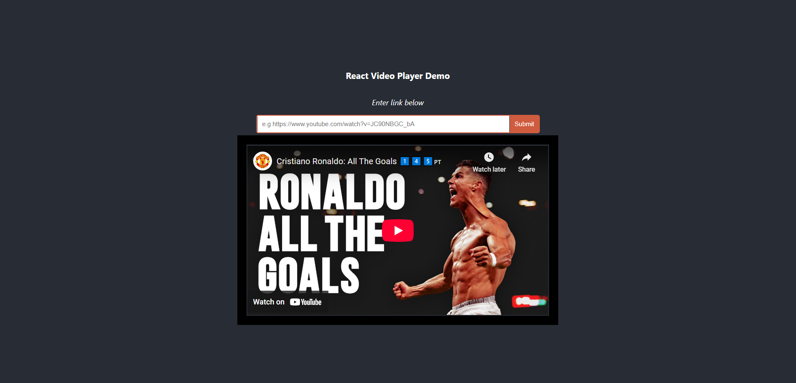
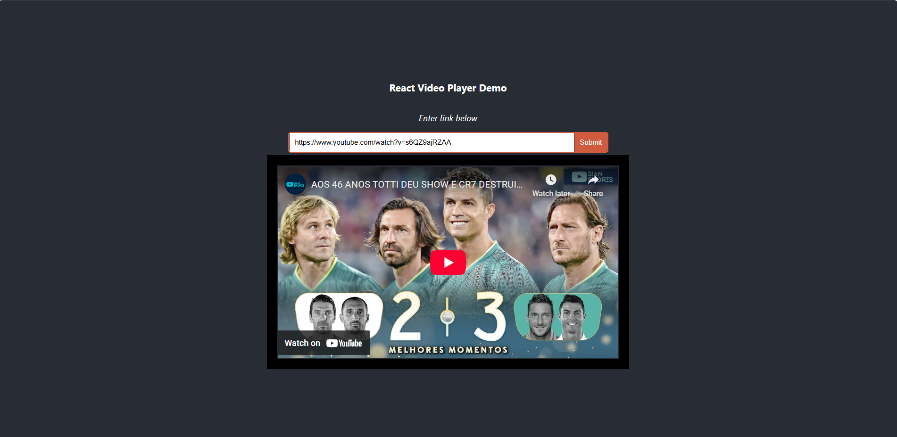
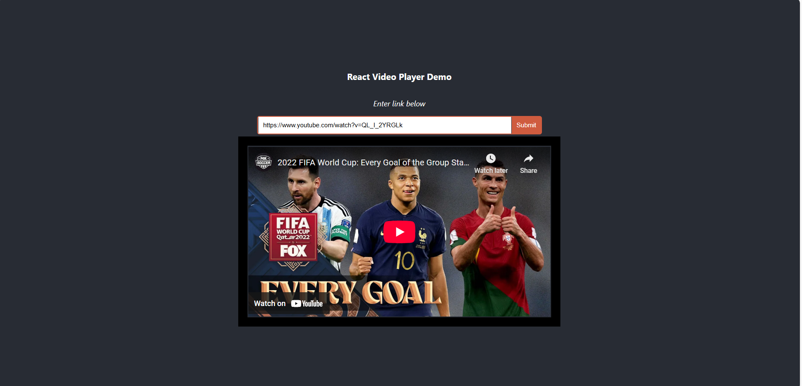
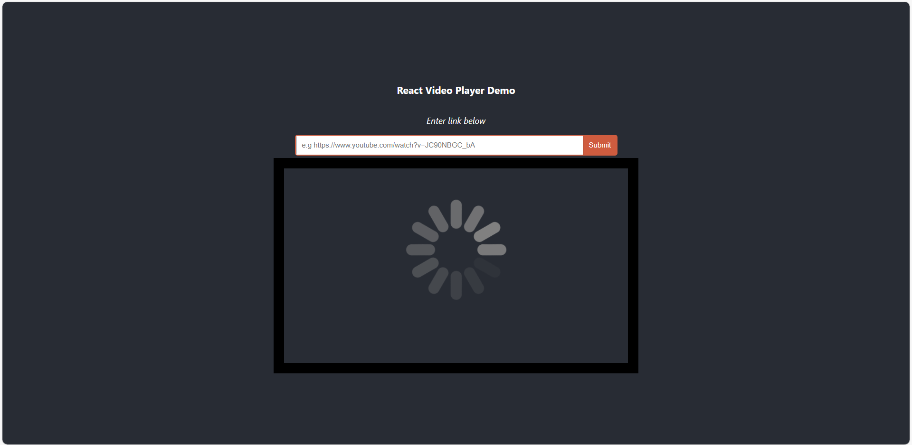

## **React Player Template TS**

**Version:** 1.1
**Date:** August 21, 2025

---

## Description

This is a frontend Application template utilizing React Player package for playing videos online in ReactJS (typescript).

## Authors

[@jadogeri](https://www.github.com/jadogeri)

## Deployment

Website is hosted using Github Pages.

 [https://jadogeri.github.io/React-Player-Template-TS](https://jadogeri.github.io/React-Player-Template-TS/)

## Repository

[source code ](https://github.com/jadogeri/React-Player-Template-TS.git)

## Screenshots
-------------------------------------------------------------------------------------------------
|  |  |
| -------------------------------------------- | -------------------------------------------- |
|  |  |

## Table of Contents

<ul>
  <li><a href="#1-introduction">1. Introduction</a>
    <ul>
      <li><a href="#11-purpose">1.1 Purpose</a> </li>
    </ul>
  </li>
  <li><a href="#5-installation">2. Installation</a> </li>
  <li><a href="#6-usage">3. Usage</a>
    <ul>
        <li><a href="#61-run-application">3.1 Run Application</a> 
          <ul>
            <li><a href="#611-run-locally">3.1.1 Run Locally</a> </li>
          </ul>
        </li>
    </ul>
  </li>
  <li><a href="#10-references">4. References</a></li>
</ul>


## **1. Introduction** ##

### **1.1 Purpose** ###

This document outlines the components, and design considerations for add printing functionality to reactjs application.

## **2. Installation** ##

* [Download and install NodeJS](https://nodejs.org/en/download)

---

## **3. Usage** ##

**Prerequisites** : Installation of NodeJS.

### **3.1 Run Application** ###

1 Open command prompt or terminal.

2 Type command git clone https://github.com/jadogeri/React-Player-Template-TS.git then press enter.

```bash
  git clone https://github.com/jadogeri/React-Player-Template-TS.git
```

3 Enter command cd React-Player-Template-TS/app then press enter.

```bash
  cd React-Player-Template-TS/app
```

#### **3.1.1 Run Locally** ####

1 Type npm install --force to install dependencies.

```bash
  npm install --force
```

2 Type npm start to run application

```bash
  npm start
```
---

## **4. References** ##

* FreeCodeCamp : [Frontend Web Development: (HTML, CSS, JavaScript, TypeScript, React)](https://www.youtube.com/watch?v=MsnQ5uepIa).
* AweSome Open Source : [Awesome Readme Templates](https://awesomeopensource.com/project/elangosundar/awesome-README-templates)
* Readme.so : [The easiest way to create a README](https://readme.so/)
* HUXN Webdev : [Master ReactJS in 7 Hours with 10 Real-World Projects 2023](https://www.youtube.com/watch?v=XrwsMN2IWnE/)
* Dave Gray : [React JS Full Course for Beginners | Complete All-in-One Tutorial | 9 Hours](https://www.youtube.com/watch?v=RVFAyFWO4go/)
* Dipesh Malvia : [Learn React JS with Project in 2 Hours | React Tutorial for Beginners | React Project Crash Course](https://www.youtube.com/watch?v=0riHps91AzE/)
* Medium : [How to add a loading spinner in React Function components](https://medium.com/@cabhishek712/implementing-a-loader-loading-spinner-in-react-function-components-950eef0f4253)
* Dev.to : [Deploying to GitHub Pages using gh-pages](https://dev.to/scc33/deploying-to-github-pages-using-gh-pages-2d95)
* Medium :[How to Implement Custom Controls with React-Player▶️: A Step-by-Step 🪜Guide 📖(with Picture-in-Picture Mode)](https://oluwadaprof.medium.com/how-to-implement-custom-controls-with-react-player-%EF%B8%8F-a-step-by-step-guide-with-8068e2717590)